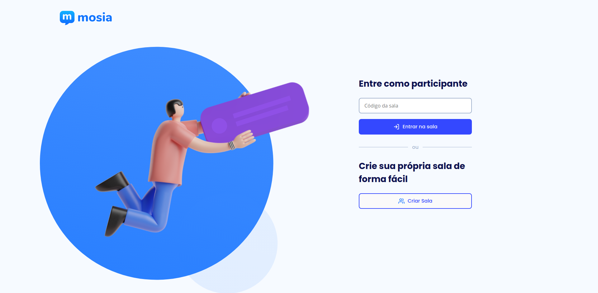

<h3 align="center"> 
	  MobileSaude.Q 🚀 Finalizado 
</h3>

</br>


<p align="center">
 <a href="#tecnologias">Tecnologias utilizadas</a> •
 <a href="#desenvolvimento">Desenvolvimento</a> •
 <a href="#features">Features</a> •  
 <a href="#preview">Preview</a> •  
 <a href="#autor">Autor</a>
</p>

  
# MobileSaude.Q

Funcionalidade para disponibilizar nas apresentações aos usuários para que possam realizar perguntas de formas anonimas e serem gerenciados por um supervisor a fim de indicar as melhores perguntas para serem sanadas.

## Tecnologias
- EJS
- CSS
- JAVASCRIPT
- NODEJS

## Desenvolvimento

Utilizado pacote de dependencias YARN (podendo ser usado o NPM)

1- Para iniciar o projeto instale todas as dependencias
```bash
  yarn install
```
2 - Rode de maneira local
```bash
  yarn start
```

Para realizar commit neste projeto execute:

```bash
  yarn commit
```
Utilizado padrões de commit [Documentação](https://typicode.github.io/husky/#/)

  


  
## Features

- Possibilidade de criar salas;
- Compartilhar link da sala com colaboradores;
- Ingressar em salas (mediante apresentação do numero);
- Possibilidade de perguntas de forma anônima ao apresenteador;
- Marcar perguntas como "lidas" mediante senha criada pelo moderador;
- Excluir perguntas mediante senha criada pelo moderador;
  

## Preview

OBS: Pode estar offline - [Link](https://mobile-saude-q.asaventurasaven.repl.co/) 

  
## Autor

- [GitHub](https://github.com/RannyZyzz)
- [Linkedin](www.linkedin.com/in/ranniêr-reis-6a2983a1)
- [Instagram](https://www.instagram.com/rannyzyzz/)
  
